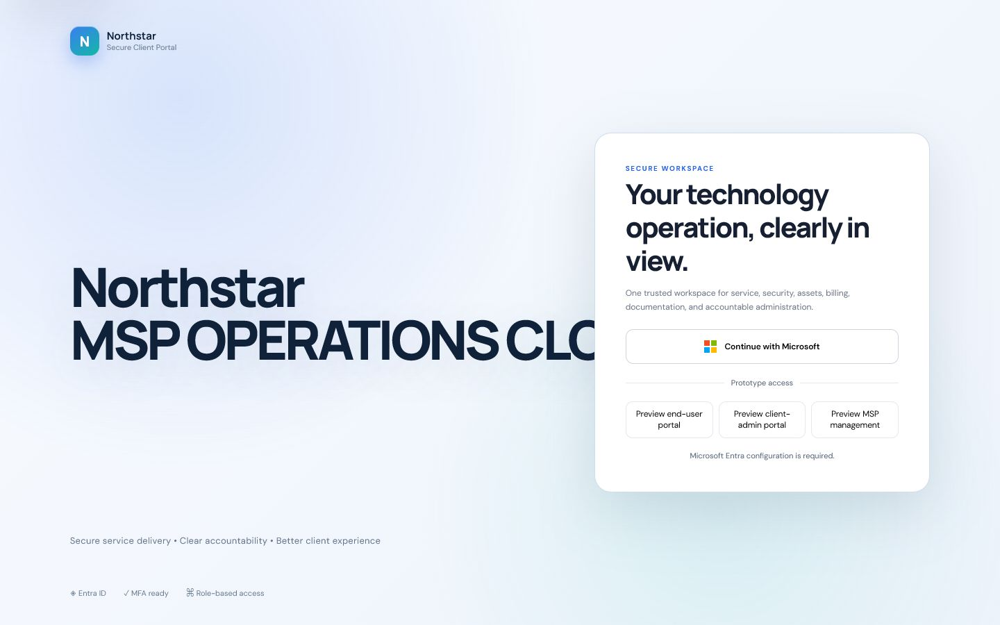
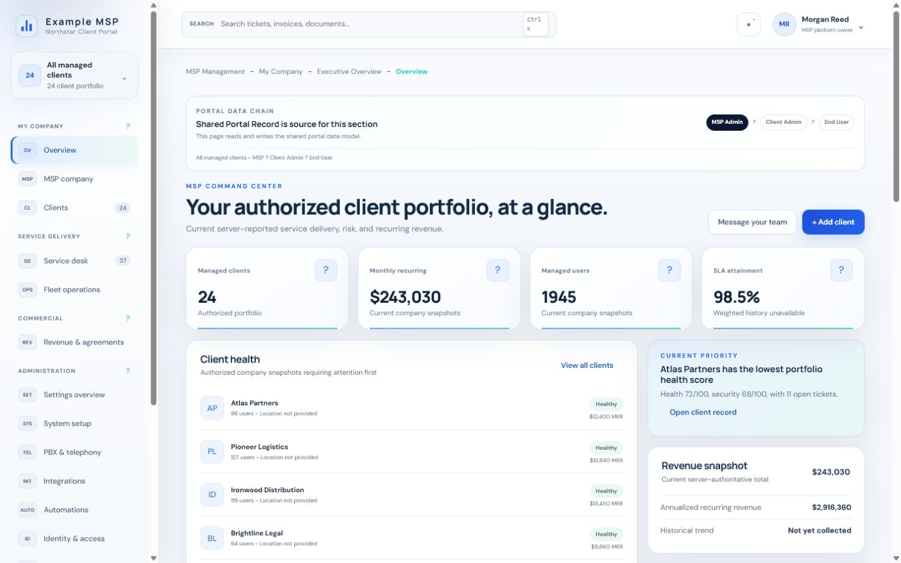
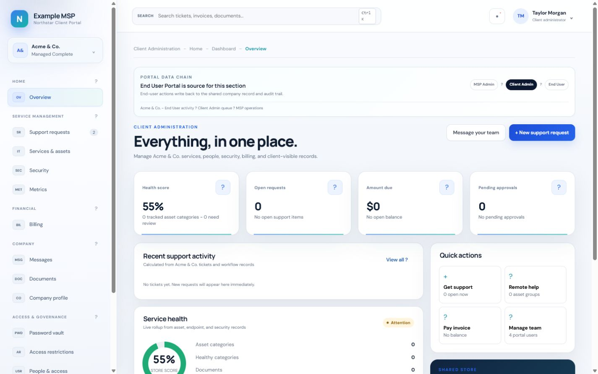
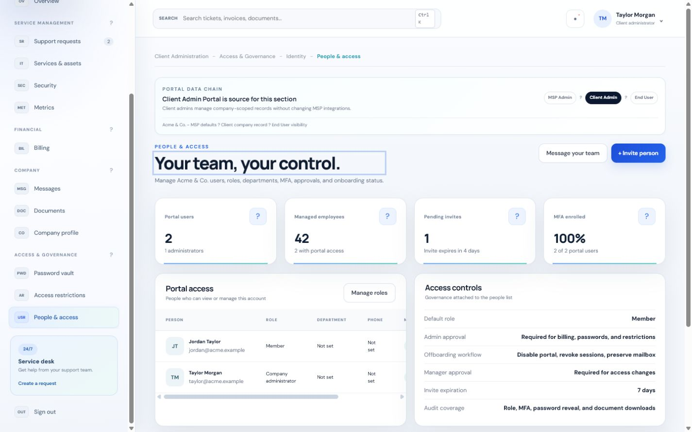
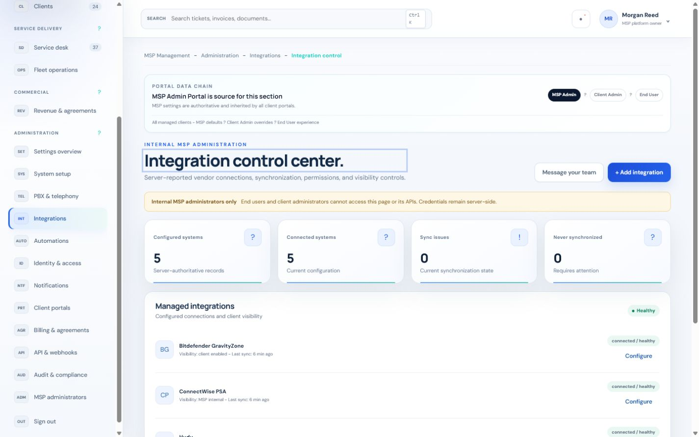

# Northstar MSP Portal

Current version: **1.0.0**

Northstar is a unified MSP portal with three isolated experiences:

- End-user self-service
- Client administration
- Internal MSP portfolio and operations management

## Product tour

### Secure sign-in

Microsoft Entra authentication is the production entry point, with local preview roles available only when explicit development demo mode is enabled.



### MSP command center

The MSP landing area summarizes the authorized client portfolio, recurring revenue, managed users, SLA attainment, client health, and current operational priorities.



### Client administration

Client administrators receive a company-scoped workspace for service activity, health, billing, approvals, documents, and common support actions.



### People and access governance

Company administrators can review portal membership, roles, MFA enrollment, access controls, and activity within their assigned tenant.



### Integration control

Internal MSP administrators can inspect server-reported vendor connections, synchronization state, visibility, and integration health without exposing credentials to client portals.



Version 1.0.0 releases the server-backed authentication, tenant isolation, company administration, records, approvals, audit, operational safeguards, and ConnectWise synchronization foundation. Modules without released server APIs remain hidden in production; explicit local demo mode retains design previews without representing them as operational integrations.

## Architecture

```text
Browser / Microsoft Entra
        |
        v
server/auth.cjs              Token signature, issuer, audience, scope, and app-role validation
        |
        v
server/repository.cjs        Provisioned identity, membership, portfolio scope, and permission resolution
        |
        v
server/database.cjs          Versioned migrations and persistent development database
        |
        v
server/app.cjs               Default-deny, tenant-scoped HTTP API and static portal delivery
```

Core records include companies, users, client memberships, MSP client assignments, feature entitlements, operational snapshots, integration metadata, and append-only application audit events.

Production operations include authenticated encrypted SQLite backups, integrity verification, offline-safe restore controls, configurable retention enforcement, database process leases, and health timestamps. See the [operations runbook](docs/OPERATIONS-RUNBOOK.md).

## Security model

Microsoft Entra establishes identity and supplies a coarse application-role ceiling. It does **not** grant company access by itself.

Every authenticated request performs the following checks:

1. Validate the access-token signature, issuer, audience, expiry, tenant, client application, delegated API scope, and recognized app role.
2. Resolve the user by the provisioned Entra tenant ID and object ID.
3. Require an active database identity.
4. Resolve an active client membership or MSP platform assignment.
5. Intersect the Entra app role with the database role.
6. Resolve the allowed company or assigned MSP portfolio.
7. Enforce the named permission required by the API route.

The `company_id` token claim is only a selection hint. It cannot create a membership or expand tenant access. Client users receive a not-found response when they guess another company's resource ID.

Preview roles are available only under `file://` or an explicitly enabled, unconfigured local demo. When Entra is configured, preview buttons and saved preview roles are ignored. Production startup rejects `DEMO_MODE=true`.

When the portal is served from `127.0.0.1` with local demo mode enabled, the role buttons use local-only demo identities that resolve through the same `/api/session`, repository, SQLite, permission, and audit pipeline as Entra users. The demo authorization header is rejected for non-loopback callers and is completely disabled when demo mode is off. A `file://` preview remains offline-only.

## Local development

Node.js 24 or later is required. Northstar's encrypted online backup uses the `node:sqlite` backup API included in that runtime baseline.

```powershell
npm install
Copy-Item .env.example .env.local
npm run build
npm run db:init
npm run start:development
```

Open `http://127.0.0.1:4173`.

Demo identities and synthetic portfolio data are disabled by default. To run the explicit local-only demo, set `DEMO_MODE=true` and `SEED_DEMO_DATA=true` in `.env.local`. Never use those flags in production.

The local database defaults to `data/northstar.db`. Migrations are stored in `server/migrations` and run automatically at startup.

No default administrator or password is created. Complete first-run setup or provision an Entra identity explicitly.

## Microsoft Entra configuration

Copy `.env.example` to `.env.local` and configure:

- `ENTRA_CLIENT_ID`
- `ENTRA_TENANT_ID`
- `ENTRA_API_AUDIENCE`
- `ENTRA_API_SCOPE`
- `ENTRA_ALLOWED_CLIENT_ID`
- `ENTRA_REDIRECT_URI`

Required application roles:

- `ClientPortal.User`
- `ClientPortal.Admin`
- `ClientPortal.Owner`
- `MSPPortal.Admin`
- `MSPPortal.Owner`

The access token must contain the `Portal.Access` delegated scope and one recognized application role.

## Provisioning an identity

Portal users are deliberately not created just-in-time from an email address or company claim. Provision the Entra tenant/object pair before first sign-in.

```powershell
$env:PORTAL_USER_OID = "entra-object-id"
$env:PORTAL_USER_EMAIL = "person@example.com"
$env:PORTAL_USER_NAME = "Person Name"
$env:PORTAL_USER_ROLE = "client_admin"
$env:PORTAL_COMPANY_ID = "acme"
npm run user:provision
```

Supported database roles are `client_user`, `client_admin`, `client_owner`, `msp_operator`, `msp_admin`, and `msp_owner`. MSP identities may use `PORTAL_PLATFORM_SCOPE=all`; otherwise their clients must be explicitly assigned in `msp_company_scopes`.

## API foundation

- `GET /api/health`
- `GET /api/health/live`
- `GET /api/health/ready`
- `GET /api/session`
- `GET /api/profile`
- `PATCH /api/profile`
- `GET /api/companies`
- `GET /api/companies/:companyId`
- `PATCH /api/companies/:companyId`
- `GET /api/companies/:companyId/summary`
- `GET /api/companies/:companyId/people`
- `POST /api/companies/:companyId/people`
- `PATCH /api/companies/:companyId/people/:userId`
- `GET /api/companies/:companyId/records`
- `POST /api/companies/:companyId/records`
- `PATCH /api/companies/:companyId/records/:recordId`
- `GET /api/companies/:companyId/approvals`
- `POST /api/companies/:companyId/approvals`
- `PATCH /api/companies/:companyId/approvals/:approvalId`
- `GET /api/internal/integrations`
- `GET /api/internal/audit`
- `GET /api/internal/settings`
- `PUT /api/internal/settings`
- `GET /api/internal/install-profile`
- `PUT /api/internal/install-profile`

Unknown API paths return JSON `404` responses. Unsupported methods return `405` with an `Allow` header. API responses include a request ID, security headers, no-store caching, and tenant-aware audit records.

## MSP system setup

The MSP Admin portal includes a System setup page for install and platform configuration. It is MSP-only and sits above client admin and end-user access in the portal data chain.

It captures:

- Deployment profile: public URL, target runtime, package channel, and asset mode.
- Database options: provider, path or connection secret, backup cadence, retention, and restore testing.
- Microsoft Entra OAuth2/OIDC: tenant ID, client ID, API scope, redirect URI, and required app roles.
- First-run tenant setup: MSP owner email, bootstrap behavior, demo-data policy, and company import source.
- Production readiness checklist for TLS, backups, audit retention, OAuth, and installer handoff.

When the app is connected to the backend, the page saves the install profile through `PUT /api/internal/install-profile` and saves individual settings through `PUT /api/internal/settings`.

## Verification

```powershell
npm test
npm run test:e2e
npm run smoke
npm run build
npm run audit:dependencies
npm run verify
```

The test suite verifies client isolation, company-claim rejection, unknown-user denial, scoped MSP portfolios, MSP owner access, role permissions, API method handling, JSON API fallthrough behavior, durable denial auditing, tenant-isolated company settings, invitation and membership lifecycle controls, last-administrator protection, document workflows, personal-profile persistence, approval ownership and terminal decisions, and install-profile persistence.

The Playwright gate runs in system Chrome and verifies automated WCAG 2 A/AA rules on the sign-in screen and all three role dashboards, keyboard skip navigation, page-heading focus, modal focus trapping and restoration, mobile navigation state, and horizontal overflow. See [Accessibility](docs/ACCESSIBILITY.md) for the supported baseline and manual release checklist.

The smoke test builds the browser assets, starts the server on a random local port with a temporary SQLite database, verifies `/api/health`, verifies static portal delivery, verifies `portal-api.js`, and saves an install profile through the real HTTP API.

`npm run startup:production` starts the built application with synthetic production configuration and a temporary database, verifies liveness, confirms readiness remains blocked before backup evidence exists, verifies static delivery, and shuts down cleanly. It does not run against production data or credentials.

See [Deployment](DEPLOYMENT.md), [release checklist](RELEASE.md), [changelog](CHANGELOG.md), and [operations runbook](docs/OPERATIONS-RUNBOOK.md) before handling customer data.

## Production database path

The included Node SQLite data store makes the foundation immediately runnable and provides deterministic automated isolation tests. It is appropriate for local development and a single-node pilot. Before a multi-instance production rollout, migrate the same repository contracts to PostgreSQL, add tenant-qualified foreign keys and forced row-level security, run the application with a non-owner database role, and test RLS using the real deployment role.

## Current boundary

The shell, authentication bootstrap, tenant context, entitlements, company APIs, summaries, durable people invitations and membership updates, personal profiles, integrations metadata, portal records, document-update approvals, install profile, tenant-isolated settings, audit storage, and ConnectWise company/ticket synchronization now have a real backend foundation. Production navigation release-gates unfinished modules; explicit demo mode retains design prototypes without representing them as operational.

## ConnectWise Platform synchronization

Northstar uses ConnectWise Platform OAuth 2.0 client credentials with the least-privilege `platform.companies.read` and `platform.tickets.read` scopes. The server sends the documented JSON token request, caches the access token until expiry, honors vendor quota headers, records rate-limited and failed runs, blocks cross-origin pagination, and never returns the client secret or bearer token to the browser.

Configure `CONNECTWISE_CLIENT_ID` and `CONNECTWISE_CLIENT_SECRET` together. Select the regional `CONNECTWISE_BASE_URL` listed in `.env.example`; production rejects non-ConnectWise origins. The default collection paths can be overridden only through server environment configuration if the approved tenant documentation specifies different paths.

MSP administrators can inspect or start synchronization through `GET` and `POST /api/internal/integrations/connectwise/sync`. Imported companies begin in onboarding state and are not automatically published to clients. Tickets are mapped through durable provider identifiers and idempotently upserted into company-scoped portal records.

ConnectWise is a trademark of ConnectWise, LLC. This application uses the ConnectWise API but is not endorsed or certified by ConnectWise.
