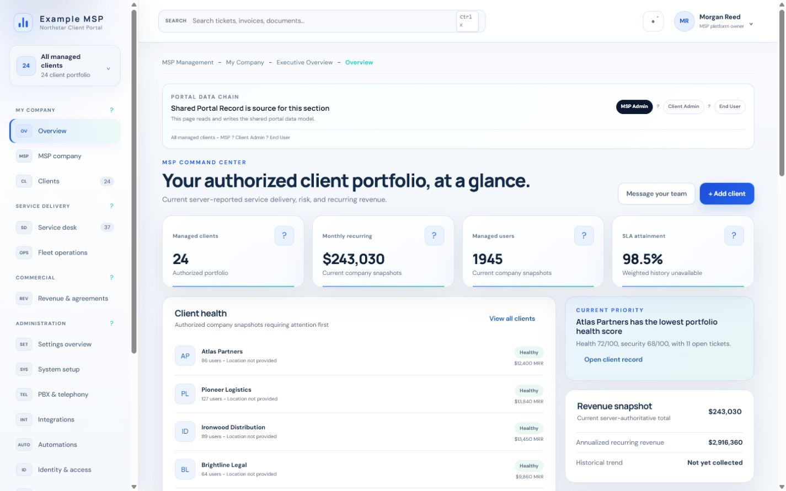
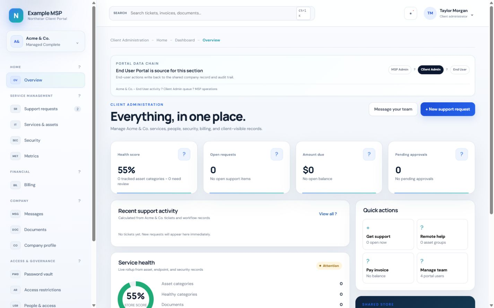
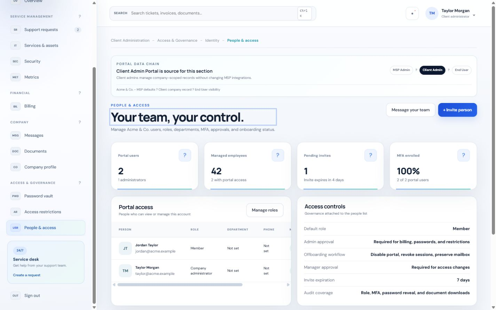
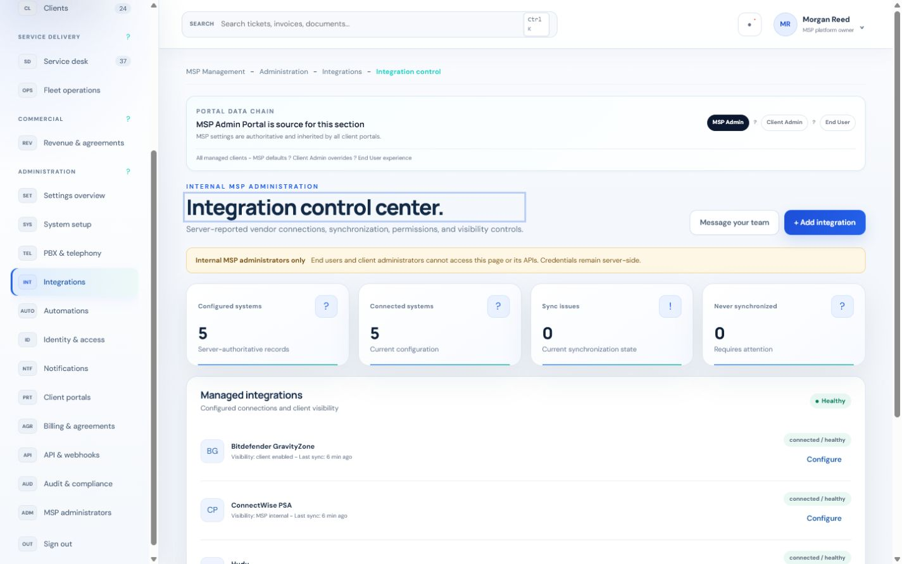

<div align="center">

# Northstar MSP Portal

**A unified MSP portal where proving who someone is never, by itself, grants access to a
client's data.**

End-user self-service, client administration, and internal MSP operations in one
application, gated by Microsoft Entra ID and default-deny tenant isolation.

[](CHANGELOG.md)
[](#local-development)
[](docs/SECURITY-MODEL.md)

[**Product site**](https://ithealthtech.github.io/northstar-msp-portal/) ·
[Security model](docs/SECURITY-MODEL.md) ·
[Architecture](docs/ARCHITECTURE.md) ·
[API reference](docs/API-REFERENCE.md) ·
[Deployment](DEPLOYMENT.md)

</div>

---

## The idea

A multi-tenant MSP portal has an awkward requirement: the MSP legitimately needs
cross-tenant reach, while every client must be sealed off from every other client. Getting
that wrong is not a bug, it is a breach.

Northstar keeps authentication and authorization as separate systems. Microsoft Entra
establishes identity and a coarse application-role ceiling — and stops there. Every request
then resolves a database identity, membership or portfolio scope, an intersected role, and
the named permission that specific route requires.

Two consequences worth knowing before you deploy:

- **Users are provisioned, not created just-in-time.** A valid Entra user in your tenant
  who has never been provisioned can authenticate and still reach nothing. That is correct.
- **The `company_id` token claim is a hint, not authority.** It cannot create a membership
  or widen tenant reach.

## Product tour

### MSP command center

The authorized client portfolio, recurring revenue, managed users, SLA attainment, client
health, and current operational priorities.



### Client administration

A company-scoped workspace for service activity, health, billing, approvals, documents, and
common support actions.



### People and access governance

Company administrators review portal membership, roles, MFA enrollment, access controls,
and activity within their assigned tenant only.



### Integration control

Internal administrators inspect vendor connections, synchronization state, visibility, and
integration health without exposing credentials to client portals.



## Architecture

```text
Browser / Microsoft Entra
        |
        v
server/auth.cjs              Token signature, issuer, audience, scope, and app-role validation
        |
        v
server/repository.cjs        Provisioned identity, membership, portfolio scope, and permission resolution
        |
        v
server/database.cjs          Versioned migrations and persistent development database
        |
        v
server/app.cjs               Default-deny, tenant-scoped HTTP API and static portal delivery
```

Full detail in [docs/ARCHITECTURE.md](docs/ARCHITECTURE.md).

## Security model

Every authenticated request runs all seven steps, in order:

1. Validate the token — signature, issuer, audience, expiry, tenant, client application,
   delegated scope, recognized app role.
2. Resolve the user by provisioned Entra tenant ID and object ID.
3. Require an active database identity.
4. Resolve an active client membership or MSP platform assignment.
5. Intersect the Entra app role with the database role — the narrower wins.
6. Resolve the allowed company or assigned MSP portfolio.
7. Enforce the named permission required by the route.

A client user who guesses another company's resource ID receives **not-found**, not
forbidden — a forbidden response would confirm the resource exists.

Production startup rejects `DEMO_MODE=true`. Preview roles work only under `file://` or an
explicitly enabled, unconfigured local demo, and are ignored entirely once Entra is
configured.

Full detail in [docs/SECURITY-MODEL.md](docs/SECURITY-MODEL.md); trust boundaries in
[docs/SECURITY-ARCHITECTURE.md](docs/SECURITY-ARCHITECTURE.md).

## Local development

Node.js 24 or later is required — the encrypted online backup uses the `node:sqlite` backup
API from that runtime baseline.

```powershell
npm install
Copy-Item .env.example .env.local
npm run build
npm run db:init
npm run start:development
```

Open `http://127.0.0.1:4173`. The local database defaults to `data/northstar.db`;
migrations in `server/migrations` run automatically at startup.

Demo identities and synthetic portfolio data are disabled by default. For the local-only
demo, set `DEMO_MODE=true` and `SEED_DEMO_DATA=true` in `.env.local`. Never use those flags
in production.

No default administrator or password is created.

## Microsoft Entra configuration

Copy `.env.example` to `.env.local` and set `ENTRA_CLIENT_ID`, `ENTRA_TENANT_ID`,
`ENTRA_API_AUDIENCE`, `ENTRA_API_SCOPE`, `ENTRA_ALLOWED_CLIENT_ID`, and
`ENTRA_REDIRECT_URI`.

Required application roles: `ClientPortal.User`, `ClientPortal.Admin`, `ClientPortal.Owner`,
`MSPPortal.Admin`, `MSPPortal.Owner`. The access token must contain the `Portal.Access`
delegated scope and one recognized application role.

## Provisioning an identity

```powershell
$env:PORTAL_USER_OID = "entra-object-id"
$env:PORTAL_USER_EMAIL = "person@example.com"
$env:PORTAL_USER_NAME = "Person Name"
$env:PORTAL_USER_ROLE = "client_admin"
$env:PORTAL_COMPANY_ID = "acme"
npm run user:provision
```

Database roles: `client_user`, `client_admin`, `client_owner`, `msp_operator`, `msp_admin`,
`msp_owner`. MSP identities may use `PORTAL_PLATFORM_SCOPE=all`; otherwise their clients
must be explicitly assigned in `msp_company_scopes`.

## Verification

```powershell
npm test
npm run test:e2e
npm run smoke
npm run build
npm run audit:dependencies
npm run verify
```

`npm test` covers client isolation, company-claim rejection, unknown-user denial, scoped MSP
portfolios, role permissions, method handling, durable denial auditing, membership
lifecycle, last-administrator protection, approvals, and install-profile persistence.

The Playwright gate verifies WCAG 2 A/AA rules on sign-in and all three role dashboards plus
keyboard, focus, and overflow behavior — see [docs/ACCESSIBILITY.md](docs/ACCESSIBILITY.md).

`npm run startup:production` boots with synthetic production configuration and confirms
readiness stays blocked until backup evidence exists.

## Production database path

The embedded Node SQLite store makes the foundation immediately runnable and enables
deterministic isolation tests. It suits local development and a single-node pilot.

Before a multi-instance rollout, migrate the same repository contracts to PostgreSQL, add
tenant-qualified foreign keys and forced row-level security, run under a non-owner database
role, and test RLS with the real deployment role.

## Current boundary

Authentication, tenant context, entitlements, company APIs, summaries, people invitations
and membership, personal profiles, integrations metadata, records, document-update
approvals, install profile, tenant-isolated settings, audit storage, and ConnectWise
company/ticket synchronization have a real backend foundation.

Production navigation release-gates unfinished modules; explicit demo mode retains design
prototypes without representing them as operational.

## Documentation

| Operators                                        | Developers                               |
| ------------------------------------------------ | ---------------------------------------- |
| [Deployment](DEPLOYMENT.md)                      | [Architecture](docs/ARCHITECTURE.md)     |
| [Operations runbook](docs/OPERATIONS-RUNBOOK.md) | [Security model](docs/SECURITY-MODEL.md) |
| [Release checklist](RELEASE.md)                  | [API reference](docs/API-REFERENCE.md)   |
| [Accessibility](docs/ACCESSIBILITY.md)           | [Contributing](CONTRIBUTING.md)          |

Read [DEPLOYMENT.md](DEPLOYMENT.md), [RELEASE.md](RELEASE.md), [CHANGELOG.md](CHANGELOG.md),
and the [operations runbook](docs/OPERATIONS-RUNBOOK.md) before handling customer data.

## Security

Report vulnerabilities privately through [SECURITY.md](SECURITY.md) — never a public issue.

## ConnectWise

Northstar uses ConnectWise Platform OAuth 2.0 client credentials with least-privilege
`platform.companies.read` and `platform.tickets.read` scopes. The client secret and bearer
token are never returned to the browser. Imported companies begin in onboarding state and
are not automatically published to clients.

ConnectWise is a trademark of ConnectWise, LLC. This application uses the ConnectWise API
but is not endorsed or certified by ConnectWise.
